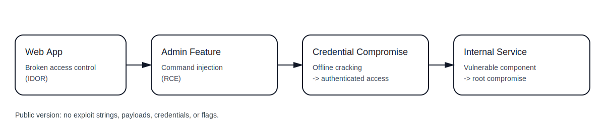

# FR-PR-2026-003 | Nocturnal - Pentest Simulation (Public)

**Type:** Realistic penetration testing simulation (lab environment)  
**Platform:** Hack The Box (Retired machine)  
**Team:** FuzzRaiders  
**Goal:** Demonstrate an end-to-end assessment workflow and reporting quality **without** publishing a step-by-step exploit walkthrough.

## What this repo includes

- Executive-style public report (sanitized)
- Methodology used (high-level)
- Findings and remediation guidance
- Detection and hardening notes (blue-team value)
- High-level attack-chain diagram

## What this repo intentionally excludes

To keep this portfolio version safe and non-instructional, we exclude:

- Exact payloads/commands and exploit one-liners
- Cracked credentials, session tokens, flags, and raw dumps
- Full evidence pack and detailed exploitation logs

> Internal evidence and full technical notes remain private and can be shared case-by-case.

## Key findings (summary)

| ID      | Finding                                   | Severity | Impact (short)                                               |
| ------- | ----------------------------------------- | -------: | ------------------------------------------------------------ |
| FR-F-01 | Broken access control (IDOR)              |     High | Unauthorized access to other users' files and sensitive data |
| FR-F-02 | Command injection in admin backup feature | Critical | Remote code execution and database exposure                  |
| FR-F-03 | Weak credential management                |     High | Offline cracking enabled SSH access and lateral movement     |
| FR-F-04 | Unpatched internal management service     | Critical | Privilege escalation to root via known vulnerability         |

## Artifacts

- Public report (PDF): `report/FR-PR-2026-003_Nocturnal_Public_Report.pdf`
- Methodology (high-level): `docs/methodology.md`
- Findings (sanitized): `docs/findings.md`
- Detection & hardening: `docs/detection-hardening.md`
- Attack-chain diagram: `assets/attack-chain.svg`

## Legal / ethics

This engagement was performed in an authorized training lab environment. Do not apply these techniques to systems you do not own or have explicit permission to test.
